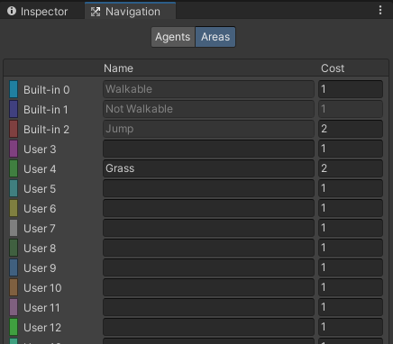

# AI Navigation
In this page we will go through all the skills needed to have a navigating AI.
We will use a combination of online resources, write ups and screenshots. 
Open your Unity projects and follow the steps below.

## Setting up AI Navigation
Install AI Navigation via the Package Manager. <br>

1. Click on the "packages:" dropdown (1) in the screenshot below.
1. Choose "Unity Registry" in the dropdown
1. Use the search box (2) and search for "AI Navigation"
1. Click "AI Navigation" in the list (3)
1. Click "Install" (4)


## Creating a NavMesh
You will need a Navigation Mesh "NavMesh" for our AI to walk on. So lets create that first, follow these instructions: <br>
1. Create an empty gameobject
1. Add the navmesh component to the empty gameobject. <br>

Follow this link for detailed instructions: <br>
[Create NavMesh](https://docs.unity3d.com/Packages/com.unity.ai.navigation@1.1/manual/CreateNavMesh.html)

If you want you know more about the NavMesh settings, have a look at these settings: <br>
[NavMesh settings](https://docs.unity3d.com/Packages/com.unity.ai.navigation@1.1/manual/NavMeshSurface.html)

## Creating a NavMesh Agent
Now we need to actually create an AI to use our NavMesh <br>

Follow this link for detailed instructions: <br>
[Create NavMesh Agent](https://docs.unity3d.com/Packages/com.unity.ai.navigation@1.1/manual/CreateNavMeshAgent.html)<br>

If you want you know more about the NavMesh settings, have a look at these settings: <br>
[NavMeshAgent Settings](https://docs.unity3d.com/Packages/com.unity.ai.navigation@1.1/manual/NavMeshAgent.html) 

## Creating an obstacle
We will create something to get in the way of our AI.

Follow this link for detailed instructions: <br>
[Create an obstacle](https://docs.unity3d.com/Packages/com.unity.ai.navigation@1.1/manual/CreateNavMeshObstacle.html)<br>

If you want you know more about the NavMesh settings, have a look at these settings: <br>
[Obstacle settings](https://docs.unity3d.com/Packages/com.unity.ai.navigation@1.1/manual/NavMeshObstacle.html)

## Create a NavMesh link
If we want to link multiple NavMeshes together, we can via a NavMeshLink

Follow this link for detailed instructions: <br>
[Create a NavMeshLink](https://docs.unity3d.com/Packages/com.unity.ai.navigation@1.1/manual/NavMeshLink.html)<br> 

If you want you know more about the NavMesh settings, have a look at these settings: <br>
[NavMeshLink settings](https://docs.unity3d.com/Packages/com.unity.ai.navigation@1.1/api/Unity.AI.Navigation.NavMeshLink.html) 

## Create a NavMeshModifierVolume
Unity calculates the cost of a path, usually based on how long the path is. The AI will try navigate down the lowest cost path.

If we want to create areas that costs the AI more to navigate across then we can modify the area with an increased (or decreased) cost.

Follow this link for detailed instructions: <br>
[Create a NavMeshModifierVolume](https://docs.unity3d.com/Packages/com.unity.ai.navigation@1.1/manual/NavMeshModifierVolume.html)<br>
<br>
If we want to add in a new Area type we can. Firstly open up the Navigation Tab as shown:
 
<br>
Then we can add a new area type, don't forget to click the Areas tab:
 
<br>
We can use these new area types with the NavMesh Modifier Volume, just add in a name and cost, and the new area will appear in the dropdown.
 

## Create new Agent types
Just like we made new Area types, we can make different Agent types.

Navigate to the Navigation Tab, if you don't have it open, open it again:
 
<br>
But this time we are going to add a new Agent type, just click the plus as shown in the screenshot below. Just don't forget to click the Agents tab:
 

## Example Code

### Move to a destination
[Move to a destination](https://docs.unity3d.com/Packages/com.unity.ai.navigation@1.1/manual/NavMoveToDestination.html) 
```
    // MoveDestination.cs
    using UnityEngine;
    
    public class MoveDestination : MonoBehaviour {
       
       public Transform goal;
       
       void Start () {
          NavMeshAgent agent = GetComponent<NavMeshAgent>();
          agent.destination = goal.position; 
       }
    }
```
### Move to mouse click
[Move to mouse click](https://docs.unity3d.com/Packages/com.unity.ai.navigation@1.1/manual/NavMoveToClickPoint.html) 
```
    // MoveToClickPoint.cs
    using UnityEngine;
    using UnityEngine.AI;
    
    public class MoveToClickPoint : MonoBehaviour {
        NavMeshAgent agent;
        
        void Start() {
            agent = GetComponent<NavMeshAgent>();
        }
        
        void Update() {
            if (Input.GetMouseButtonDown(0)) {
                RaycastHit hit;
                
                if (Physics.Raycast(Camera.main.ScreenPointToRay(Input.mousePosition), out hit, 100)) {
                    agent.destination = hit.point;
                }
            }
        }
    }
```

### Agent Patrol Between a Set of Points
[Agent Patrol Between a Set of Points](https://docs.unity3d.com/Packages/com.unity.ai.navigation@1.1/manual/NavAgentPatrol.html) 
```
    // Patrol.cs
    using UnityEngine;
    using UnityEngine.AI;
    using System.Collections;


    public class Patrol : MonoBehaviour {

        public Transform[] points;
        private int destPoint = 0;
        private NavMeshAgent agent;


        void Start () {
            agent = GetComponent<NavMeshAgent>();

            // Disabling auto-braking allows for continuous movement
            // between points (ie, the agent doesn't slow down as it
            // approaches a destination point).
            agent.autoBraking = false;

            GotoNextPoint();
        }


        void GotoNextPoint() {
            // Returns if no points have been set up
            if (points.Length == 0)
                return;

            // Set the agent to go to the currently selected destination.
            agent.destination = points[destPoint].position;

            // Choose the next point in the array as the destination,
            // cycling to the start if necessary.
            destPoint = (destPoint + 1) % points.Length;
        }


        void Update () {
            // Choose the next destination point when the agent gets
            // close to the current one.
            if (!agent.pathPending && agent.remainingDistance < 0.5f)
                GotoNextPoint();
        }
    }
```
