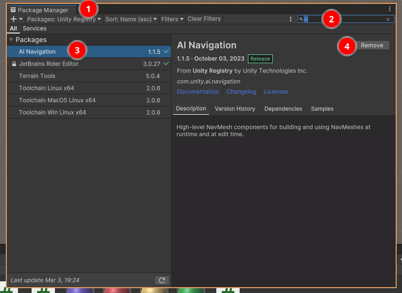

# AI Navigation
In this page we will go through all the skills needed to have a navigating AI.
We will use a combination of online resources, write ups and screenshots. 
Open your Unity projects and follow the steps below.

## Setting up AI Navigation
Install AI Navigation via the Package Manager.  

1. Click on the "packages:" dropdown (1) in the screenshot below.
1. Choose "Unity Registry" in the dropdown
1. Use the search box (2) and search for "AI Navigation"
1. Click "AI Navigation" in the list (3)
1. Click "Install" (4)

## Creating a NavMesh
You will need a Navigation Mesh "NavMesh" for our AI to walk on. So lets create that first, follow these instructions:  
1. Create an empty gameobject
1. Add the navmesh component to the empty gameobject.  

Follow this link for detailed instructions:  
[Create NavMesh](https://docs.unity3d.com/Packages/com.unity.ai.navigation@1.1/manual/CreateNavMesh.html)

If you want you know more about the NavMesh settings, have a look at these settings:  
[NavMesh settings](https://docs.unity3d.com/Packages/com.unity.ai.navigation@1.1/manual/NavMeshSurface.html)

## Creating a NavMesh Agent
Now we need to actually create an AI to use our NavMesh  

Follow this link for detailed instructions:  
[Create NavMesh Agent](https://docs.unity3d.com/Packages/com.unity.ai.navigation@1.1/manual/CreateNavMeshAgent.html)

## Creating an obstacle
We will create something to get in the way of our AI.

Follow this link for detailed instructions:  
[Create an obstacle](https://docs.unity3d.com/Packages/com.unity.ai.navigation@1.1/manual/CreateNavMeshObstacle.html)

[Obstacle settings](https://docs.unity3d.com/Packages/com.unity.ai.navigation@1.1/manual/NavMeshObstacle.html)

## Create a NavMesh link
If we want to link multiple NavMeshes together, we can via a NavMeshLink

Follow this link for detailed instructions:  
[Create a NavMeshLink](https://docs.unity3d.com/Packages/com.unity.ai.navigation@1.1/manual/CreateOffMeshLink.html) 

## 

