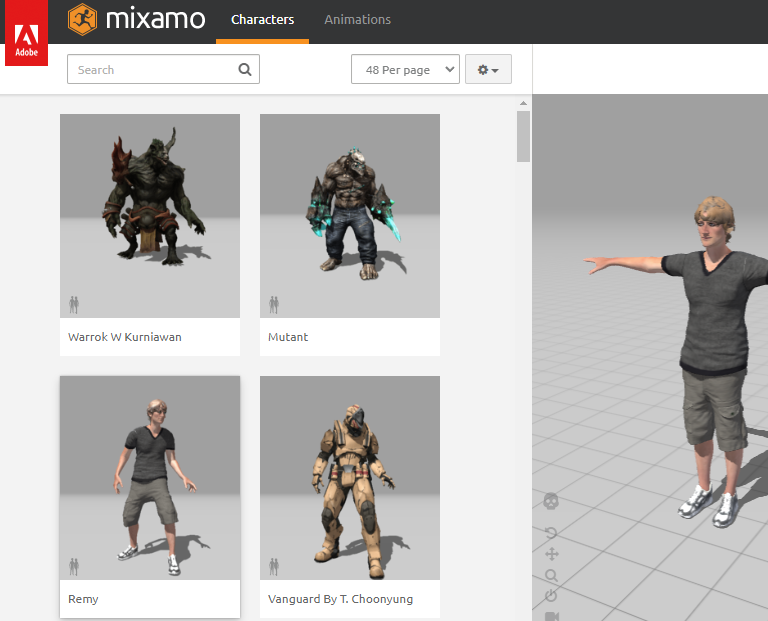
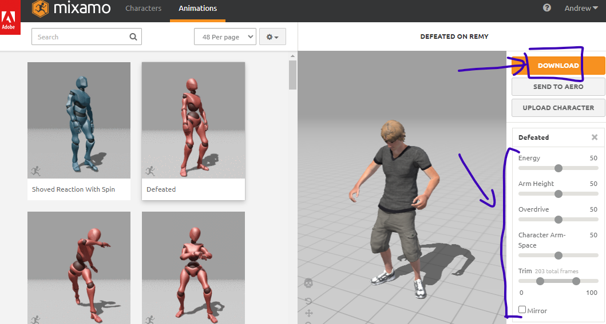
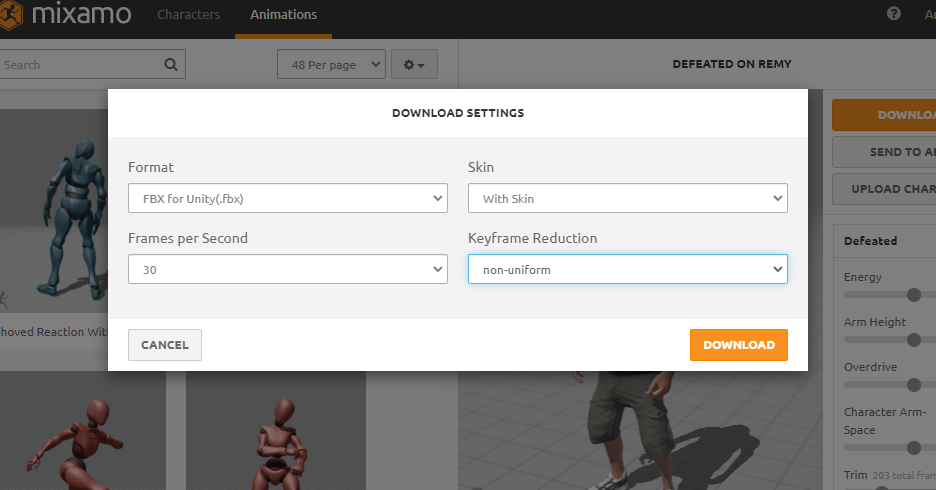
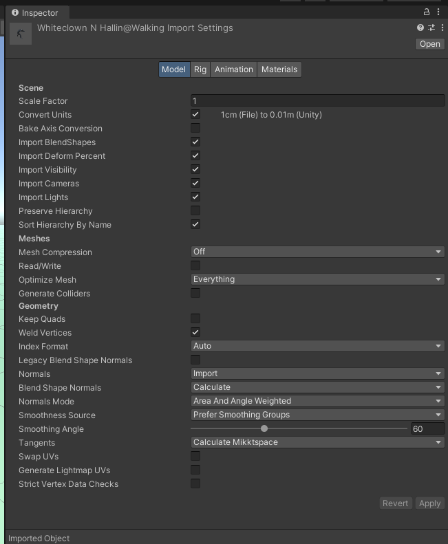
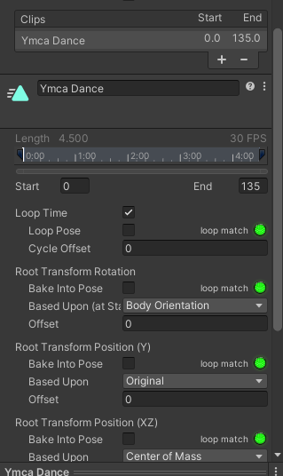
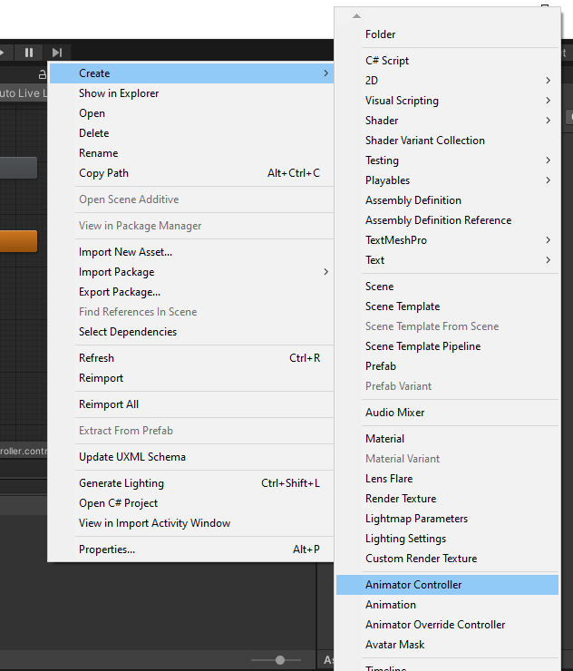

# How to add Animations
Lets go through the steps of adding animation from [Mixamo.com](https://www.mixamo.com)

## Mixamo.com

1. Login using an adobe account
1. Choose a character and animation.

1. Change animation settings
1. Click download

1. Follow these settings. 
Format: FBX for unity  
Frames per second: 30  
Skin: **Only one of your files need to include the skin, choose without skin if you have already downloaded a file with the skin**   
Keyframe reduction: non uniform  

## Unity Import Settings
1. Drag those files into unity's project tab with your other assets. 
1. If you click on the files you should see the following settings in your inspector.
1. When you change settings, don't forget to click apply in the inspector.
1. The model might be looking white, you can fix that in the "Materials" tab.

### Model Tab
Check the following settings on the Model tab in the import settings  

**Scale Factor / convert units:**  
If your model is not at the correct scale you can modify these two settings.

**Read/Write:**  
If you ever want to modify the mesh of your model in code, enable this.

**Normals:**  
If your model was imported looking "inside out" then change this from "import" to "calculate".

**Generate lightmap UV:**  
Tick this if you want to bake lights on this model.

## Rig Tab
Check the following settings on the Rig tab in the import settings  
**These will be different depending on if you have already created an avatar definition. You just want to create it once, on the file that includes the model of your character.**

For the file with the model of your character included:  
* Animation type: Humanoid  
* Avatar Definition: Create from this model 

For the file that only includes animation:  
* Animation type: Humanoid  
* Avatar Definition: Copy From Other Avatar  
* Source: The Avatar from the other file (Click the target icon to choose it)

## Animation Tab

**Clips:** 
If your file contains more than one animation, you can create multiple clips by clicking the + icon. 
You set the start and end of the clip in the "Start" and "End" boxes just below the "Clips" section

**Loop time:** 
If you want the animation to loop, check this box.

**Loop Pose:** 
Forces the animation to loop smoothly

**Root Motion:** 
There are a bunch of settings related to root motion, labeled "Root Transform".
* You might want to "Bake Into Pose" if you don't want the root motion to be applied either "Rotation" or "Transform (y) or (XZ)"
* The green circle shows how well the animation loops in each section.

Don't forget to click apply.

## Materials Tab
Your model might be looking white, these will fix that.

1. Press both Extract Textures and Extract Materials
1. Place them in a folder
1. Click fix normal maps if you get the popup

## Actually Animating your model
Time to animate, drag your model into the scene. We need to include a controller.

### Animation Controller
Right click the project tab and create a new "Animation Controller"

### Animator
To open the animator go to the following: 
Window-> Animation -> Animator  

