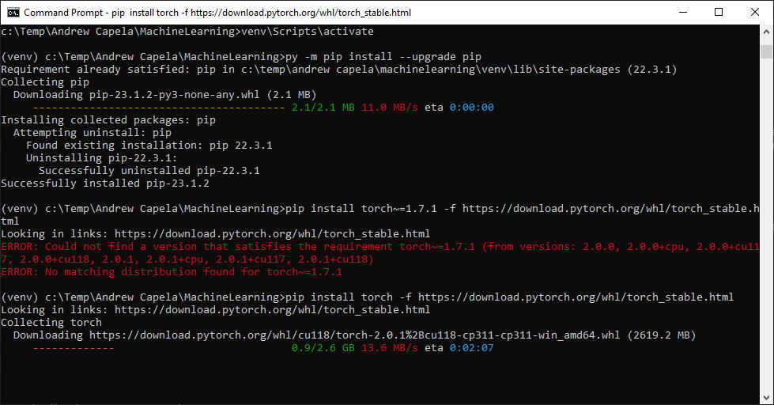

# Machine Learning

## Introduction

Machine learning in unity takes a few steps to set up. There are instructions on how to set it up at tafe.


## Step 1: Command Prompt

We are going to have to use command prompt to get this to work. It might seem scary at first but its actually quite simple.

Firstly open up command prompt (Type CMD in the start menu to find it)


There are a few useful commands that we will need to know. To use the following commands, just type them in to your Command Prompt window.


* __dir__: <br/> (Directory) "dir" will display all files and folders within the directory you are currently in (in the screenshot it would be C:\Users\acapela). Think of a directory as the folder you are currently in.
* __cd [Directory name]__:<br/>  (Change Directory) "cd" will allow you to change the directory you are in, just type in cd and then type the directory you want to open. (e.g. "cd Documents")
* __del [Directory or File Name]__: <br /> (Delete) if you want to delete a folder or directory you can run this command (e.g. "del temp.txt")
* __py__ or __python__: <br /> (Python) Once we have python installed, we can use "py" or "python" to run python specific command. In our case we will be using "py -3.8".


## Step 2: Python Setup
We are going to need to have python, at tafe we already have it installed but we need to make sure we are using the correct version.

Ensure you have python installed (and to work out which version you have) type in "py" into your Command Prompt window. It will also enter you in python mode


To exit this mode, type in exit() or press Ctrl-Z plus Enter.

**We need to have python version 3.8 installed.**

1. If you do not have Python 3.8 install it from here. https://www.python.org/downloads/release/python-3810/ <br /> To install python at tafe, place the installer in "C:\temp"


2.  To ensure you are using the correct verion of python, we are going to be using the command "py -3.8" instead of just "py"
```
py -3.8
```
 OR 
```
python -3.8
```

3. Create a Unity Project (Basic 3D, Built-in Render pipeline). If you are at tafe, you may need to place your project in "C:\Temp"

4. Using "cd", go to your project (Same folder as your Assets, Packages and Project settings)
```
cd c:\Temp\MachineLearning\
```

5. Create a virtual environment by typing in the following command
```
py -3.8 -m venv venv
```

6. To activate that virtual environment type:
```
venv\Scripts\activate
```

## Step 3: Virtual Environment Setup


Now that we set up and are in our virtual environment, your Command Prompt should look like the above screenshot. If it doesn't, please look over [Step 2](#step-2:-python).
The following will be commands used within the virtual environment. Don't be scared of all the text that appears with each command.



1. Install/Upgrade pip. <br /> pip is a package manager for python, which allows you to install packages for python.
```
pip install --upgrade pip
```

2. Install PyTorch <br /> PyTorch is a Machine Learning(ML) framework.
```
pip install torch -f https://download.pytorch.org/whl/torch_stable.html
```

3. Install MLAgents <br /> MlAgents is unity's Low Level python API.
```
pip install mlagents
```

4. Test MlAgents <br /> Test to see if its all working nicely, you might need to do the next step if it gives you an error.
> mlagents-learn --help


5. Extras:
* Downgrade protobuf <br /> Only if you can an error that mentions downgrading protobuf do the following command, then do step 4 again.
```
pip install protobuf==3.20.*
```

* At home, if the "mlagents-learn --help" doesnt work, you may need to install the CUDA Toolkit <br /> https://developer.nvidia.com/cuda-toolkit
* At home, if the "mlagents-learn --help" doesnt work, you may need to install cuDNN https://developer.nvidia.com/cudnn

## Step 4: Unity Setup

Lets finally head into unity. Leave your Command Prompt open.

1. Install the MLAgents package from the Package Manager. <br /> Window ->  Package Manager -> Packages: Unity Registry -> ML Agents -> Download/Install


## Step 5: Unity ML Project
Congrats! You have set up a Unity Machine Learning Project! It currently does nothing though, lets fix that by adding in an agent and train it. (We will need your command prompt soon).

  1. Create the following scripts
```
using System.Collections;
using System.Collections.Generic;
using UnityEngine;
using Unity.MLAgents;
using Unity.MLAgents.Actuators;
using Unity.MLAgents.Sensors;

public class MoveToGoalAgent : Agent
{
    [SerializeField] private Transform _targetTransform;

    public override void OnEpisodeBegin()
    {
        transform.position = Vector3.zero;
    }
    public override void CollectObservations(VectorSensor sensor)
    {
        sensor.AddObservation(transform.position);
        sensor.AddObservation(_targetTransform.position);
    }
    public override void OnActionReceived(ActionBuffers actions)
    {
        float moveX = actions.ContinuousActions[0];
        float moveZ = actions.ContinuousActions[1];

        float moveSpeed = 1f;
        transform.position += new Vector3(moveX, 0, moveZ) * Time.deltaTime * moveSpeed;
    }

    public override void Heuristic(in ActionBuffers actionsOut)
    {
        ActionSegment<float> continuousActions = actionsOut.ContinuousActions;
        continuousActions[0] = Input.GetAxisRaw("Horizontal");
        continuousActions[1] = Input.GetAxisRaw("Vertical");
    }

    private void OnTriggerEnter(Collider other)
    {
        if (other.TryGetComponent<Goal>(out Goal goal))
        {
            SetReward(+1f);
            EndEpisode();
        }
        if (other.TryGetComponent<Wall>(out Wall wall))
        {
            SetReward(-1f);
            EndEpisode();
        }
    }
}

```
```
using UnityEngine;

public class Goal : MonoBehaviour
{
}
```
```
using UnityEngine;

public class Wall : MonoBehaviour
{

}
```

3. Create the following scene 
 <br />
 <br />
 <br />
 <br />


## Step 5: Train Your Model

Time to train your AI model, we are going to have to run 

1. I hope your Command Prompt is still open, if not open it then navigate to your projects folder like we did before
```
cd c:\Temp\MachineLearning\ 
```

&emsp;&nbsp;&nbsp; Then to ensure you are in the Virtual Environment.
```
venv\Scripts\activate
```


2. Run the following command in Command Prompt
```
mlagents-learn
```


If you need to restart mlagents-learn then use --resume to resume, or --force to restart training from scatch.
```
mlagents-learn --resume
```
```
mlagents-learn --force
```
 3. Press play in unity 
 <br />  You should see your AI hard at work training itself and learning how to get the ball.